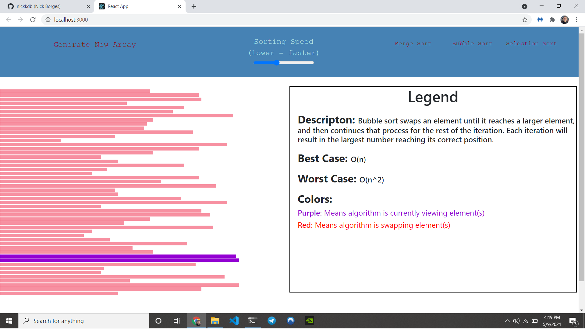

# Sorting Visualizer

https://nickkdb.github.io/Sorting-Visualizer/
    
## Table of Contents
- [Description](#Description)
- [Usage](#Usage)
- [Questions](#Questions)

## Description
> This site creates a visualization of popular sorting algorithms, allowing the user to compare speeds and sorting methods of different algorithms. Users are given information on each algorithm, such as a description, and Big-O runtime. 

## Usage
> To use this project, navigate to the link provided. Alter the speed if desired, and choose the algorithm you would like to view. After completion, you can generate a new array and start again!

## Questions
To reach me with additional questions:
>
> Find me on [GitHub](https://github.com/nickkdb)
>
> Send me an [Email](mailto:nborges.dev@gmail.com)
